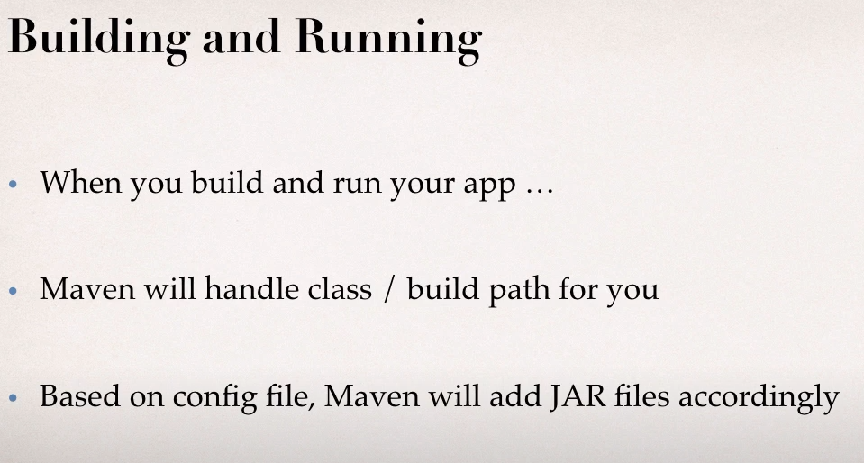
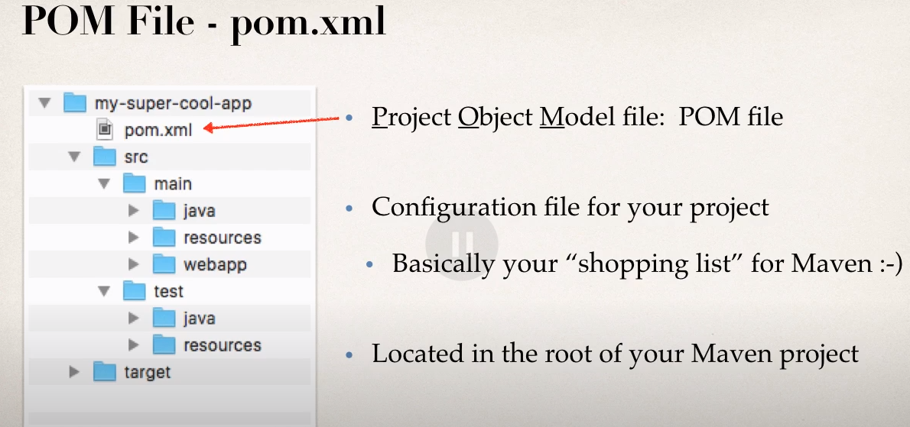
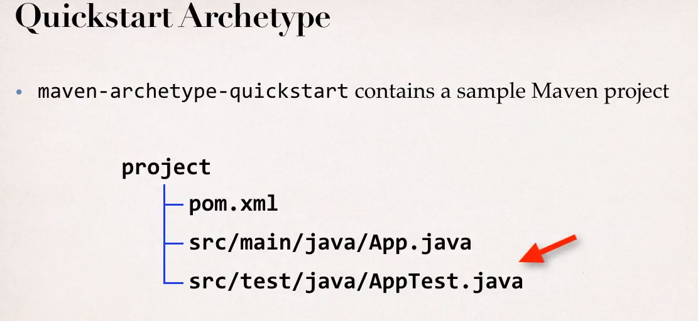
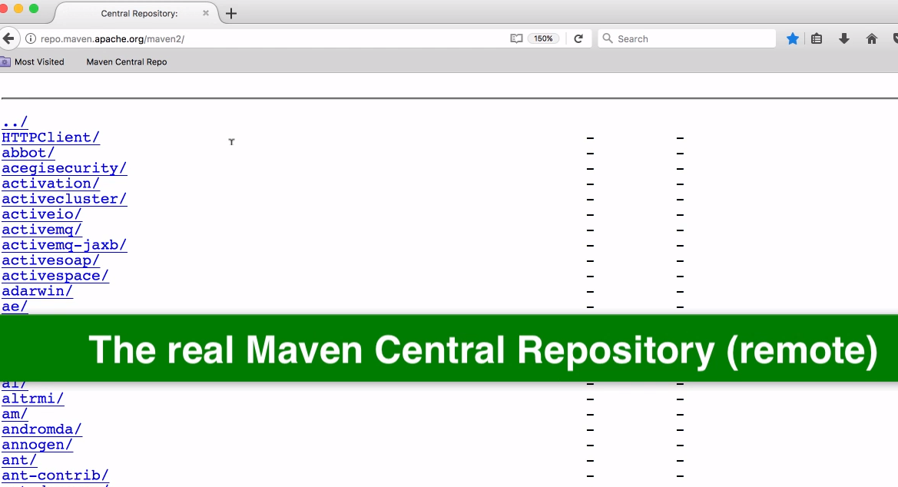
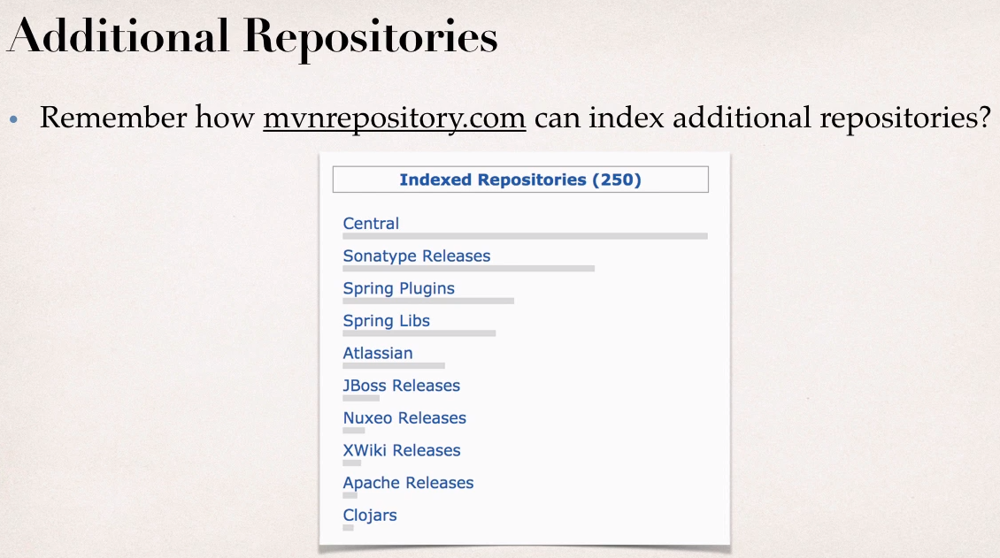

# JD Maven Leanrnings

## Maven Resources Luv2code
1. Maven Reference Manual : https://maven.apache.org/guides/
2. Maven eBooks : https://www.sonatype.com/resources/whitepapers-reports-and-books
3. Maven Cheat Sheet : http://www.luv2code.com/mavenecheatsheet https://www.jrebel.com/blog/maven-cheat-sheet


luv2code: https://www.youtube.com/watch?v=Fe6lrsPmseo&list=PLEAQNNR8IlB7uvr8EJbCNJq2I82A8cqE7
in28mins: https://www.youtube.com/watch?v=0CFWeVgzsqY
simplilearn: https://www.youtube.com/watch?v=p0LPfK_oNCM&t=571s

---
## luv2code

## What You Will Learn during this Step 01:
- Maven overview part 1




---

## What You Will Learn during this Step 02:
- Maven overview part 2


---
## What You Will Learn during this Step 03:
- Key Concept part 1




---
## What You Will Learn during this Step 04:
- Key Concept part 2 Demo Find Dependencies


## What You Will Learn during this Step 05:
- Key Concepts Part 3





---
## What You Will Learn during this Step 06:
- Creating a Simple Project - Part 1


---
## What You Will Learn during this Step 07:
- Creating a Simple Project - Part 2

---
## What You Will Learn during this Step 08:
- Creating a Web Project

---
## What You Will Learn during this Step 09:
- Maven Repositories Overview


---
## What You Will Learn during this Step 10:
- Local Repository


---
## What You Will Learn during this Step 11:
- Maven Central Repository
### Maven central repository
https://repo.maven.apache.org/maven2/




---
## What You Will Learn during this Step 12:
- Additional Repositories Overview




---
## What You Will Learn during this Step 13:
- Additional Repositories Demo

```xml
<dependencies>
		<!-- https://mvnrepository.com/artifact/com.atlassian.mail/atlassian-mail -->
		<dependency>
			<groupId>com.atlassian.mail</groupId>
			<artifactId>atlassian-mail</artifactId>
			<version>5.0.0</version>
		</dependency>

		<dependency>
			<groupId>junit</groupId>
			<artifactId>junit</artifactId>
			<version>3.8.1</version>
			<scope>test</scope>
		</dependency>
	</dependencies>
	
	<repositories>
	 	  
	 	   <repository>
	 	      <id>atlassian</id>
	 	      <name>this artifact is located at AtlassianPkgs repository</name>
	 	      <url>https://packages.atlassian.com/maven-public</url>
	 	   </repository>
	
	</repositories>
```
---
## What You Will Learn during this Step 14:
- Private Repositories


---

## simplilearn


